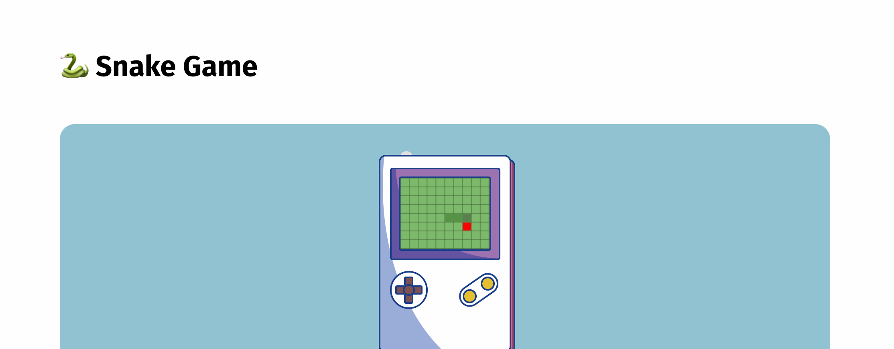

<p align="center">
  <h1>🐍 SnakeGame</h1>
</p>

<p align="center">
  Jogo da cobrinha no gameboy.
</p>

<h1 align="center">
    
</h1>

**Enviado**: [itch.io](https://itch.io/jam/game-off-2021/rate/1260575)

# :computer: Tecnologias

Esse projeto foi realizado usando as seguintes tecnologias:

<ul>
  <li><a href="https://www.javascript.com/">JavaScript</a></li>
  <li><a href="https://developer.mozilla.org/docs/Web/API/Canvas_API">Canvas</a></li>
</ul>

# :construction_worker: Como rodar o projeto

### :computer: Baixando o projeto

```bash
# Clone o repositório em sua máquina
$ git clone https://github.com/guilhermeivo/snake-game.git
```

## Licença

Esse projeto está sob licença. Veja o arquivo [`LICENÇA`](https://github.com/guilhermeivo/snake-game/blob/master/LICENSE) para mais detalhes.